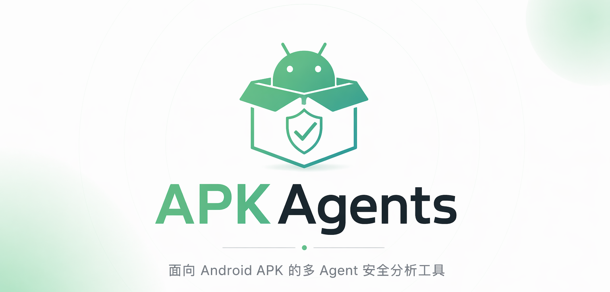
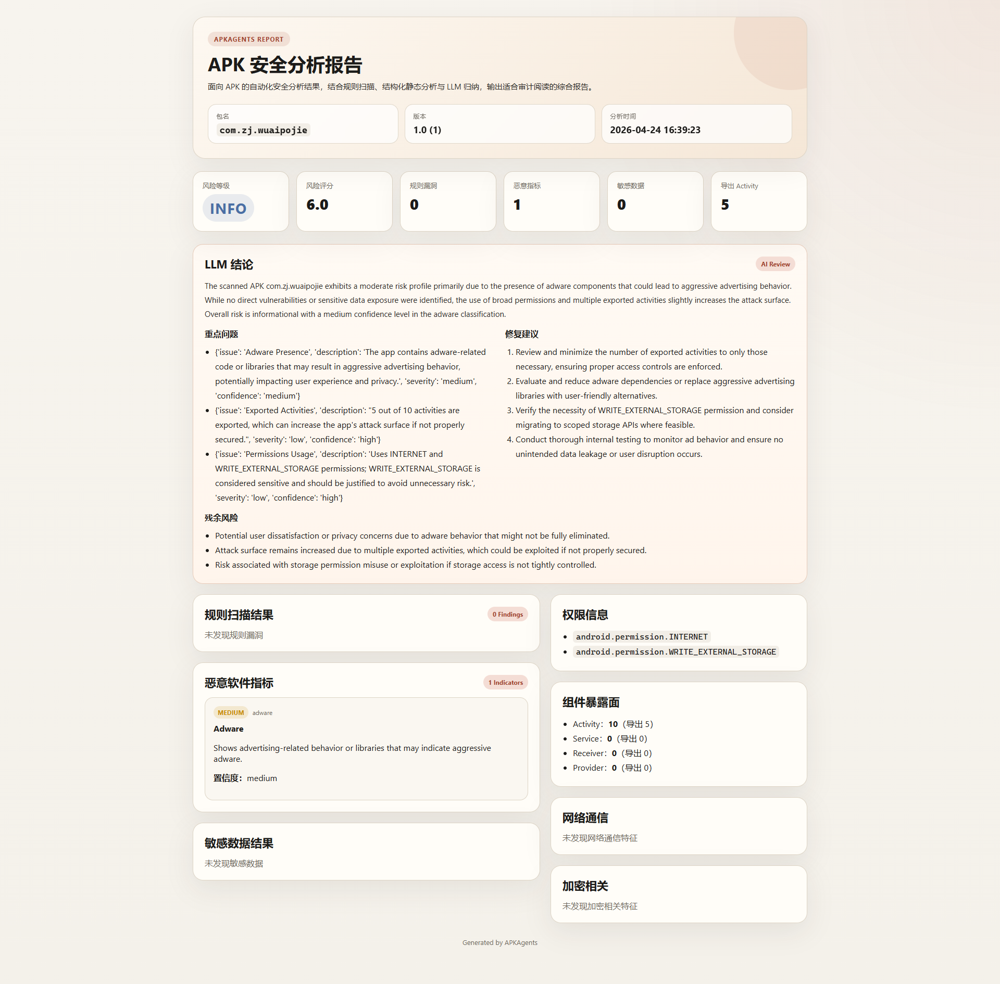

# APKAgents



<p align="center">
  面向 Android APK 的多 Agent 安全分析工具。
</p>

<p align="center">
  负责解包、反编译、规则扫描、恶意特征检测、LLM 复核与审计报告生成。
</p>

<p align="center">
  
  
  
  
  
</p>

<p align="center">
  
  
  
  
</p>


## 项目截图



## 项目简介

`APKAgents` 是一个用于 Android APK 静态安全分析的实验性项目。  
它把分析任务拆分给多个职责明确的 Agent，由调度器串联成一条完整流程：

- APK 解包
- Java / Smali 反编译
- Manifest、权限、组件暴露面分析
- 规则扫描与敏感数据检测
- 恶意软件指标识别
- LLM 结果复核与总结
- Markdown / HTML / JSON 报告输出

这不是一个只靠模板拼接结果的脚本，而是一个可以继续扩展成更强多 Agent 安全系统的基础框架。

## 核心特点

### 1. 多 Agent 流水线

当前项目包含这些主要角色：

- `ExtractorAgent`：负责 APK 解包、资源与签名信息提取。
- `DecompilerAgent`：负责调用 `jadx`、`apktool` 等工具生成源码材料。
- `AnalyzerAgent`：负责提取包信息、权限、组件、网络与加密相关元数据。
- `ScannerAgent`：负责规则扫描、敏感数据检测、恶意软件指标检测，并支持 LLM 复核。
- `ReporterAgent`：负责聚合分析结果，生成结构化结论和 LLM 摘要。
- `FormatterAgent`：负责输出 Markdown、HTML、JSON 报告。
- `OrchestratorAgent`：负责统一调度整条分析流程。

### 2. 规则扫描 + LLM 复核

项目采用双层分析思路：

- 第一层由规则和外部工具链提供确定性的候选发现。
- 第二层由 LLM 对结果做归纳、去噪、优先级排序和修复建议补充。

这样既保留了规则分析的稳定性，也让最终报告更接近人工审计的阅读体验。

### 3. 面向展示与集成的报告输出

分析完成后会生成：

- `report.html`
- `report.md`
- `report.json`

其中：

- `HTML` 适合直接展示和分享。
- `Markdown` 适合审计记录和代码评审。
- `JSON` 适合平台集成和自动化处理。

## 工作流程

```text
APK
  -> ExtractorAgent
  -> DecompilerAgent
  -> AnalyzerAgent
  -> ScannerAgent
  -> ReporterAgent
  -> FormatterAgent
  -> HTML / Markdown / JSON Report
```

## 项目结构

```text
APKAgents/
|-- agents/         # Agent 核心实现
|-- config/         # 配置文件
|-- rules/          # 规则定义
|-- templates/      # 模板与提示词
|-- tools/          # 外部工具封装
|-- utils/          # 通用工具与 LLM Client
|-- assets/         # README/文档资源
|-- main.py         # 命令行入口
`-- requirements.txt
```

## 环境依赖

- Python `3.10+`
- Java 运行环境
- Android 相关工具：
- `apktool`
- `jadx`
- `aapt`
- `apksigner`

## 安装

```bash
git clone https://github.com/RytterMohn/APKAgents.git
cd APKAgents
pip install -r requirements.txt
```

## 快速开始

基础分析：

```bash
python main.py sample.apk
```

指定输出目录：

```bash
python main.py sample.apk -o output
```

启用详细日志：

```bash
python main.py sample.apk -v
```

## 配置说明

默认配置文件：

- [config/default.yaml](config/default.yaml)

本地运行配置示例：

- [config/local-run.example.yaml](config/local-run.example.yaml)

建议做法：

1. 复制一份 `config/local-run.example.yaml`。
2. 填入你自己的工具路径与网关配置。
3. 将真实 API Key 放在环境变量或本地私有配置中。
4. 不要把本地专用配置提交到仓库。

## LLM 支持

项目可以在不启用 LLM 的情况下运行。  
启用后，LLM 主要用于：

- 结果归纳
- 重点问题提炼
- 风险摘要
- 修复建议生成
- 残余风险说明

当前实现默认兼容 Anthropic `messages` 风格接口；如果你的网关提供兼容协议，可以直接接入。

## 输出内容

一轮分析通常会生成：

```text
output/
|-- report.html
|-- report.md
`-- report.json
```

最新 HTML 报告已经包含这些模块：

- 总览信息
- 风险评分与统计卡片
- LLM 总结
- 规则扫描结果
- 恶意软件指标
- 敏感数据结果
- 权限信息
- 组件暴露面
- 网络通信
- 加密相关

## 当前定位

当前版本更接近：

`工具链分析 + 规则扫描 + LLM 二次总结`

也就是说，它已经具备多 Agent 的基本骨架，但目前仍然偏向“流水线式分工”。  
如果继续演进，可以进一步拆分成更强的安全角色，例如攻击面分析、隐私风险分析、代码风险分析和误报复核等专门 Agent。

## 开源注意事项

提交到 GitHub 前，建议确保仓库中不包含：

- 本地输出目录
- `__pycache__`
- JVM 崩溃日志
- 真实 API Key
- 个人机器绝对路径
- 本地专用配置文件

## License

MIT，详见 [LICENSE](LICENSE)。
